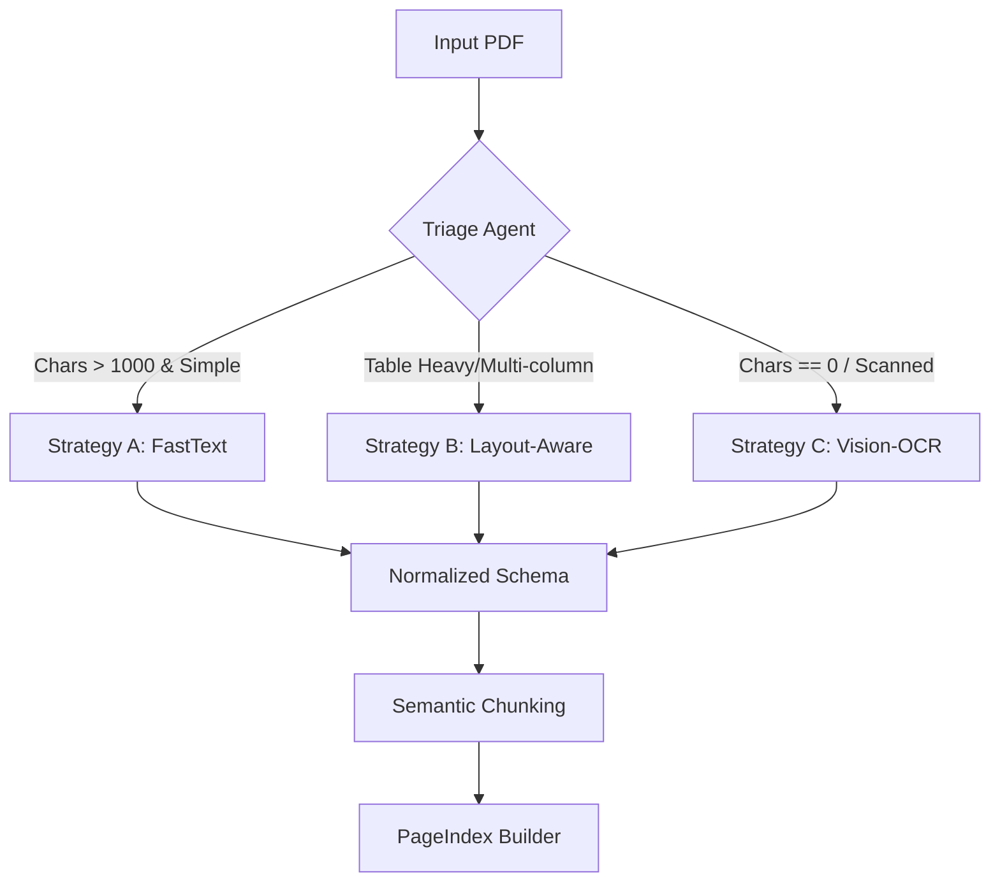

# Domain Notes: Document Archetypes and Strategy Routing

## Summary of Findings

Based on the first-page analysis from `research/density_check.py`, we identified three practical document archetypes for routing extraction strategies.

## Archetypes Identified

1. **Image-only scanned pages (OCR-required)**  
   Documents where extracted text is zero or near zero, indicating the first page is likely a scan/image layer rather than embedded text.

2. **Text-rich, simple-layout documents (FastText-friendly)**  
   Documents with high character counts and strong character density, where direct text extraction is reliable and efficient.

3. **Text-present, layout-complex documents (table/structure-aware)**  
   Documents where characters are extractable but page structure (e.g., tables or multi-column formatting) requires layout-aware parsing.

## Evidence from Current Sample

- **Security_Vulnerability_Disclosure_Standard_Procedure_2.pdf** returned **0 characters** on page 1.  
  This strongly indicates a scanned/image-based page and supports routing to **Strategy C (OCR/Vision)**.

- **Consumer Price Index March 2025.pdf** returned **2,405 characters** with high character density.  
  This profile makes it an excellent candidate for **Strategy A (FastText)**.

- **CBE Annual Report 2015-16_1.pdf** also returned **0 characters** on page 1, matching the image-only scan pattern and reinforcing the OCR-required archetype.

## Decision Tree

Use the following routing logic:

- If **Chars == 0** → **Strategy C**
- If **Chars > 0** and **Layout is complex (Tables)** → **Strategy B**
- If **Chars > 1000** and **Layout is simple** → **Strategy A**

## Operational Note

Character count and density are strong first-pass routing signals, but layout complexity should be validated (e.g., table detection) before final strategy assignment for text-bearing documents.

## Tooling Comparison

| Tool       | Speed Profile | Strength in Current Workflow                                                    | Observed Result in CPI Report           | Best Use Case                                                  |
| ---------- | ------------- | ------------------------------------------------------------------------------- | --------------------------------------- | -------------------------------------------------------------- |
| pdfplumber | Fast          | Excellent for first-pass triage metrics (character count, image count, density) | Supports rapid density-based routing    | Lightweight screening and strategy trigger detection           |
| Docling    | Slower        | Stronger layout understanding and structural extraction                         | Detected **5 tables** in the CPI report | Layout-aware parsing for table-heavy or multi-column documents |

## Pipeline Visualization

## Conclusion

The document archetypes and routing triggers have now been validated through comparative testing with both pdfplumber and Docling. With archetype detection and strategy selection criteria established, the project is ready to transition to **Phase 1 (Data Modeling)**.
